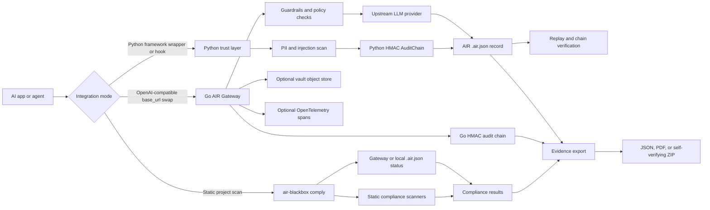

# AIR Blackbox Architecture

AIR Blackbox is an AI governance control plane for recording, scanning,
replaying, and exporting evidence about AI agent activity. The repository
contains two closely related runtime paths:

- A Python package and CLI (`air-blackbox`) for compliance scans, AI-BOM
  discovery, replay, framework trust layers, runtime monitoring, and evidence
  bundle generation.
- A Go gateway and evidence toolchain for an OpenAI-compatible reverse proxy,
  AIR record writing, vault references, HMAC audit-chain entries, compliance
  export, checkpoint signing, and optional Rekor anchoring.

This document describes the current implementation in this repository. Where
behavior is planned, partial, or implemented in only one path, it is called out
explicitly.

## High-Level System



The CLI entry point is defined in `pyproject.toml` as
`air-blackbox = air_blackbox.cli:main`. The main commands relevant to this
architecture are:

- `comply`: builds a compliance view from gateway status, local `.air.json`
  records, static code checks, optional GDPR/bias/US-law scanners, and optional
  local LLM analysis.
- `discover`: generates an AI inventory and CycloneDX 1.6 AI-BOM from observed
  runtime records.
- `replay`: loads `.air.json` records and reconstructs timelines.
- `export`: emits JSON evidence, PDF reports, or a self-verifying ZIP evidence
  bundle.

## End-to-End Scan Flow

`air-blackbox comply --scan <path>` is orchestrated by
`sdk/air_blackbox/cli.py` and `sdk/air_blackbox/compliance/engine.py`.

1. The CLI creates a `GatewayClient` with the gateway URL, optional `runs_dir`,
   and the scan path.
2. `GatewayClient.get_status()` checks the gateway health endpoint. If the
   gateway is reachable, it also calls `/v1/audit` to obtain chain and runtime
   control status.
3. The same client analyzes local `.air.json` records from `RUNS_DIR`, `./runs`, `../runs`, `~/.airblackbox/runs`, or a `runs/` directory inside the scanned project. It aggregates models, providers, token totals, status counts, and timestamps. When a `scan_path` is provided, trust-layer record analysis can also derive PII alert counts, injection alert counts, and chain-hash presence.
4. `run_all_checks()` runs static scanners. The main code scanner walks Python
   files, skipping common build, virtualenv, cache, and dependency directories.
   It checks for patterns such as LLM error handling, fallback logic, input
   validation, PII handling, documentation, type hints, logging, tracing,
   human-in-the-loop controls, retries, injection defense, output validation,
   OAuth/delegation controls, and hiring-context checks.
5. The compliance engine groups findings by regulation area. EU AI Act checks
   cover Articles 9, 10, 11, 12, 14, and 15. US, GDPR, and bias/fairness
   scanners are included when applicable.
6. `detect_frameworks()` scans Python imports and call patterns for LangChain,
   CrewAI, OpenAI, Anthropic, Google ADK/Vertex, and related frameworks. The
   detected framework is used to recommend a trust-layer package or integration.
7. Unless `--no-llm` is set, the CLI may run `deep_scan()` through a local
   Ollama model if Ollama and the configured model are available. The model path
   is optional; the scanner falls back to rule-based results when unavailable.
8. The CLI renders a table or JSON output and, unless `--no-save` is used,
   stores scan history through the compliance history module.

The scan is therefore a hybrid assessment. Runtime evidence comes from the
gateway and `.air.json` records; static evidence comes from the repository
being scanned; optional local model analysis augments rule-based findings.

## Trust Layer Framework Hooks

The Python trust layers are implemented under `sdk/air_blackbox/trust/`.
They are designed to be non-blocking: when audit writing fails, the wrapped
agent or LLM call should continue, with a best-effort fallback to writing an
unchained `.air.json` record in several wrappers.

Implemented hooks include:

- LangChain: `AirLangChainHandler` subclasses LangChain callback handling and
  records LLM start/end/error events and tool start/error events. It scans
  prompts for PII and injection patterns, extracts token usage when present,
  and writes through `AuditChain`.
- CrewAI: `AirCrewAITrust` injects `step_callback` and `task_callback`
  handlers and instruments per-agent step callbacks. `AirCrewAICrew` wraps
  `kickoff()` to log crew start, completion, errors, agent steps, tool calls,
  task completions, and delegation-like events.
- OpenAI SDK: `AirOpenAIWrapper` proxies `client.chat.completions.create()`,
  optionally redirects the wrapped client to the gateway URL, records duration,
  model, provider, token usage, status, and errors.
- AutoGen: `AirAutoGenTrust` wraps agents, registers message hooks when
  supported, instruments `generate_reply()`, and wraps registered functions or
  tools.
- Haystack: `AirHaystackTracer` implements a tracing interface with spans that
  can be flushed to `.air.json`; `AirHaystackPipeline` wraps `pipeline.run()`.
- Google ADK: `AirADKAgentWrapper` wraps async `invoke()`, sync `run()`, and
  tool functions reachable from the agent.
- Claude Agent SDK: `air_claude_hooks()` returns PreToolUse, PostToolUse,
  PostToolUseFailure, and Stop hooks. The pre-tool hook scans tool input,
  classifies tool risk, writes audit records, warns on PII, and can deny
  high-confidence prompt injection. `air_permission_handler()` can log and
  optionally deny higher-risk tools.

The common trust-layer output is a `.air.json` record containing fields such as
`run_id`, `timestamp`, `type`, `model`, `provider`, `tokens`, `duration_ms`,
`status`, `pii_alerts`, `injection_alerts`, and `chain_hash` when the HMAC chain
writer succeeds. The canonical PII and injection regex strings are shared from
`sdk/air_blackbox/gate/runtime.py` by most trust layers.

The package metadata advertises optional extras for `langchain`, `crewai`,
`haystack`, `openai`, `autogen`, `adk`, `claude`, `pdf`, `gate`, and `pqc`.
<<<<<<< HEAD
The root `sdk/README.md` mentions an `AirTrust` facade. In this repository, `AirTrust` is implemented in `sdk/air_blackbox/__init__.py` and users can import it with `from air_blackbox import AirTrust`. The current limitation is that `air_blackbox.trust.__init__` does not re-export that facade.
=======
The root `sdk/README.md` mentions an `AirTrust` facade. In this repository it is implemented in
`sdk/air_blackbox/__init__.py` and can be imported via `from air_blackbox import AirTrust`,
while `air_blackbox.trust.__init__` currently does not re-export it.
>>>>>>> f35a8ba545d069cbbd5714998faba698cb1399c3

## Gateway Recording Path

The Go gateway in `cmd/gateway/main.go` starts an OpenAI-compatible reverse
proxy implemented in `pkg/proxy/proxy.go`.

For `/v1/chat/completions` and `/v1/responses`:

1. Optional gateway authentication checks `X-Gateway-Key` or `X-Api-Key`.
2. A run ID and OpenTelemetry span are created.
3. The request body is parsed for model, prompt, tools, and streaming mode.
4. Optional prevention guardrails may redact PII, filter tools, downgrade a
   model, or block the request.
5. Optional optimization can route the model based on analytics.
6. Optional detection guardrails evaluate session-level behavior such as token
   budgets, prompt loops, retry storms, and error spirals.
7. The gateway forwards the request to the configured upstream provider.
8. The response is streamed or buffered back to the caller.
9. In a background goroutine, the gateway best-effort stores request and
   response content in the vault, writes an AIR record, and appends a compact
   record to the Go audit chain if the trust layer is enabled.

The AIR file writer (`pkg/recorder/recorder.go`) writes one
`<run_id>.air.json` record per interaction. The record includes model,
provider, endpoint, vault references, SHA-256 checksums for vaulted request and
response content, token counts, duration, status, and optional trajectory
fields. The vault client (`pkg/vault/vault.go`) stores blobs in S3-compatible
storage and returns `vault://...` references plus SHA-256 checksums.

## Audit Chain And Tamper Evidence

There are two HMAC audit-chain implementations in this repository.

### Python `.air.json` chain

`sdk/air_blackbox/trust/chain.py` maintains a thread-safe in-process HMAC
chain. Each call to `AuditChain.write(record)`:

1. Ensures `run_id`, `version`, and `timestamp` exist.
2. Computes `HMAC-SHA256(signing_key, previous_hash || json.dumps(record,
   sort_keys=True))`.
3. Stores the hex digest in `record["chain_hash"]`.
4. Writes the record as `<run_id>.air.json`.
5. Advances the in-memory previous hash to the raw HMAC digest.

The first previous hash is the literal bytes `b"genesis"`. The signing key is
read from `TRUST_SIGNING_KEY` or falls back to `air-blackbox-default`.

Tamper evidence comes from the dependency between consecutive records. If a
record is modified, its recomputed HMAC no longer matches the stored
`chain_hash`; because the next record's expected hash depends on the previous
digest, later records fail as well.

The standalone verifier embedded in self-verifying evidence bundles removes
`chain_hash` before recomputing each record, matching the Python write path.
The repository also has replay-chain verification in
`sdk/air_blackbox/replay/engine.py`; that code loads records by timestamp and
checks stored hashes, but it currently recomputes over the raw loaded record.
For auditor-facing verification of exported ZIP evidence, use the bundled
`verify.py` path described below.

### Go gateway chain

`pkg/trust/chain.go` signs compact chain entries rather than mutating each AIR
record. Each `AuditChain.Append(runID, recordJSON)`:

1. Computes `record_hash = SHA-256(recordJSON)`.
2. Creates a `ChainEntry` with a sequence number, run ID, record hash,
   previous entry hash, HMAC signature, and timestamp.
3. Signs `sequence|run_id|record_hash|prev_hash` with HMAC-SHA256.
4. Hashes the full chain entry JSON to become the next entry's `prev_hash`.

`AuditChain.Verify()` checks both the HMAC signature and `prev_hash` linkage.
This detects record modification, entry modification, deletion from the middle
of the chain, and reordering. As with any HMAC chain, an attacker with the
signing key can forge a new internally consistent history, so production use
depends on key management and external anchoring for stronger time-of-existence
proof.

### Checkpoints and anchoring

The Go evidence stack adds checkpoints in `pkg/trust/checkpoint.go`. A
checkpoint records the current chain length, chain head hash, and timestamp.
`evidencectl checkpoint` fetches `/v1/audit/export`, recomputes the head from
exported chain entries, and signs the checkpoint with ML-DSA-65 and Ed25519.

`pkg/trust/anchor.go` can publish the Ed25519 signature and checkpoint payload
to Sigstore Rekor. The code intentionally carries both signatures because Rekor
can verify Ed25519 today, while ML-DSA-65 remains in the local evidence bundle
for post-quantum signature verification. This checkpoint/anchoring flow is Go
tooling; it is separate from the Python CLI's self-verifying ZIP export.

## Evidence Bundle Generation And Verification

AIR Blackbox currently has multiple evidence export formats.

### Python JSON evidence

`air-blackbox export --format json` calls
`sdk/air_blackbox/export/bundle.py`. It builds a JSON document containing:

- Gateway status.
- Compliance scan results from `run_all_checks()`.
- CycloneDX 1.6 AI-BOM data from `generate_aibom()`.
- Replay statistics and chain verification summary.
- An HMAC-SHA256 attestation over the bundle content, excluding the attestation
  field itself.

The signing key comes from `TRUST_SIGNING_KEY` or falls back to `air-blackbox-default`.
The `--signing-key` option is currently only applied in the `--format evidence` export path.

### Python PDF report

`air-blackbox export --format pdf` uses the same JSON evidence bundle and then
renders a human-readable PDF through `sdk/air_blackbox/export/pdf_report.py`.
This path requires the optional `reportlab` dependency.

### Python self-verifying ZIP evidence

`air-blackbox export --format evidence` calls
`sdk/air_blackbox/export/evidence_bundle.py`. It creates a ZIP file containing:

-`audit_chain.json`: ordered trust-layer records with valid chain hashes, used for HMAC chain verification.
- `scan_results.json`: compliance scan output.
- `bundle_meta.json`: metadata and SHA-256 digests for included files.
- `verify.py`: a standalone verifier using only the Python standard library.
- `aibom.json`: optional, when supplied by the caller.

Verification is intentionally offline:

```bash
python verify.py --key <signing-key>
```

The verifier first checks each included file against its SHA-256 digest in
`bundle_meta.json`. It then recomputes the Python HMAC chain from `genesis`,
removing each stored `chain_hash` before hashing the record. A PASS result
means the bundle files match the manifest and the included audit records match
the supplied signing key and chain order. A FAIL result means either the wrong
key was supplied or the evidence was modified.

### Go evidence package and PDF

`evidencectl export` and the gateway `/v1/audit/export` endpoint use
`pkg/trust/export.go` to produce a Go `EvidencePackage` containing chain
entries, compliance report data, chain validity, time range, and an
HMAC-SHA256 attestation. `evidencectl pdf` renders that package through the Go
PDF exporter.

The current `evidencectl export` command builds a new in-memory chain for
demonstration after connecting to the vault; production gateway exports should
come from `/v1/audit/export`, which serializes the live gateway audit chain.

## Current Boundaries And Adoption Considerations

- The Python scanner is not a formal certification engine. It maps concrete
  code and runtime signals to compliance-oriented findings and fix hints.
- Runtime compliance quality depends on actually routing traffic through the
  gateway or installing a trust layer that writes `.air.json` records.
- Python trust layers are best-effort and intentionally non-blocking. This is
  safer for application availability, but teams that require fail-closed audit
  capture should add deployment-level enforcement.
- The default HMAC keys (`air-blackbox-default` and other local defaults) are
  development conveniences. Production deployments should set strong secrets
  through environment variables or a secrets manager.
- The Python evidence ZIP verifies HMAC-chain integrity and file digests. The
  Go checkpoint flow adds digital signatures and optional external timestamping
  via Rekor. These are separate export surfaces today.
- `AirTrust` is implemented and exported from `air_blackbox`, so adopters can use `from air_blackbox import AirTrust`. The current limitation is that `air_blackbox.trust.__init__` does not expose or re-export the facade directly.
- ML-DSA-65 support exists in the Go checkpoint/signing code. The Python
  self-verifying ZIP currently verifies HMAC-SHA256 chains with stdlib-only
  code and does not require ML-DSA libraries.
