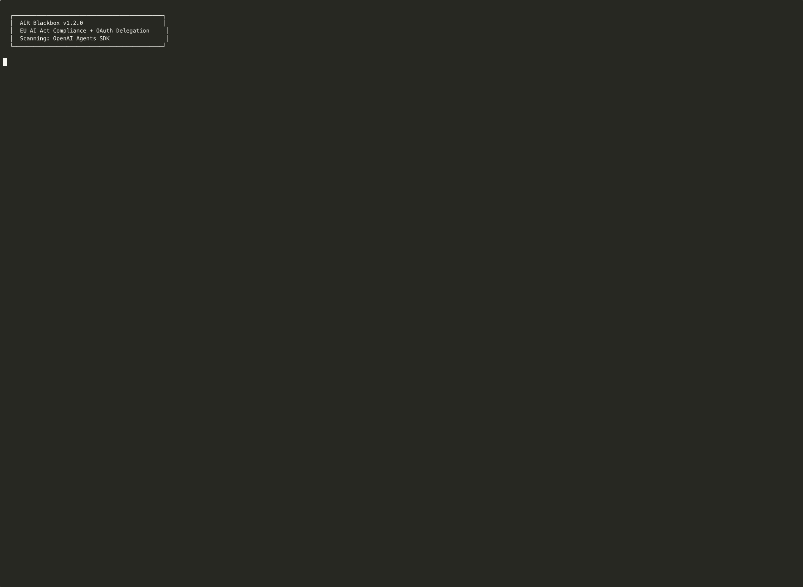
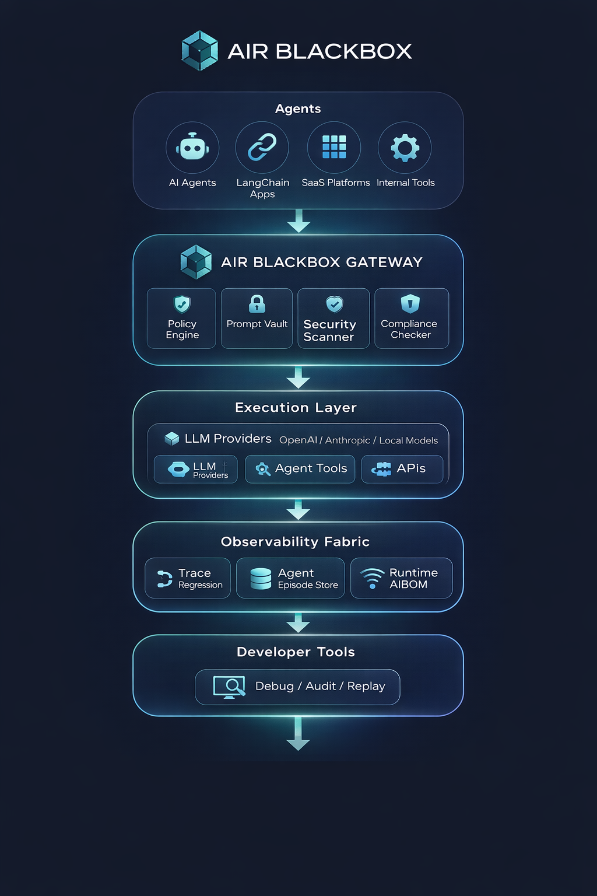
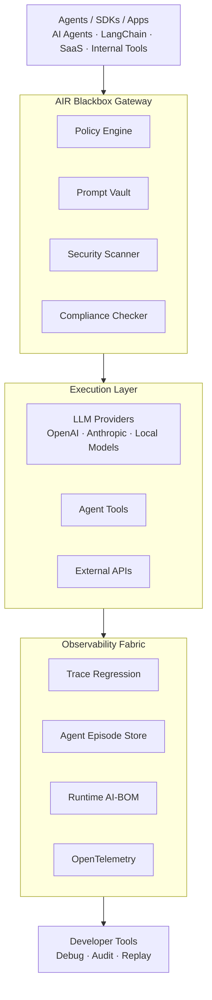

# AIR Blackbox

**See exactly what your AI agent did — every prompt, every tool call, every decision — in one trace.**



[](https://pypi.org/project/air-blackbox/)
[](https://github.com/airblackbox)
[](https://github.com/airblackbox/gateway/actions/workflows/ci.yml)
[](LICENSE)

```
pip install air-blackbox
```

Your agent made 47 LLM calls, burned $12 in tokens, and returned "I don't know." Which call went wrong? AIR Blackbox records every LLM call, tool invocation, and agent decision as a tamper-proof, replayable trace — so you can debug agent failures in seconds instead of hours.

## 30-Second Demo

No Docker. No config. No API keys.

```bash
pip install air-blackbox
air-blackbox demo
```

You'll see:

- 10 sample AI agent records generated (4 models, 3 providers)
- A full audit trail you can scrub through call-by-call
- PII detection and prompt injection scanning on every record
- HMAC-SHA256 chain verification (tamper-proof — modify any record and the chain breaks)

Then explore what it captured:

```bash
air-blackbox replay              # Scrub through the full timeline
air-blackbox replay --verify     # Verify nothing was tampered with
air-blackbox discover            # See every model, provider, and tool detected
air-blackbox comply -v           # Check EU AI Act compliance (20 checks, Articles 9-15)
air-blackbox export              # Signed evidence bundle for auditors
```

## How It Works

AIR Blackbox is a reverse proxy + Python SDK. Route your AI traffic through it and every call is recorded, analyzed, and traceable — automatically.

```
Your AI Agent  →  AIR Blackbox Gateway  →  LLM Provider
                         │
                         ├── Tamper-proof audit record (.air.json)
                         ├── PII detection + prompt injection scanning
                         ├── Full trace: prompts, responses, tool calls, latency, cost
                         ├── AI-BOM generation (models, tools, providers)
                         └── EU AI Act compliance mapping (Articles 9-15)
```

The gateway is a **witness, not a gatekeeper.** It cannot cause your AI system to fail. Recording is best-effort; proxying is guaranteed.

## Quick Start

**Option 1: Wrap your OpenAI client (2 lines)**

```python
from air_blackbox import AirBlackbox

air = AirBlackbox()
client = air.wrap(openai.OpenAI())
# Every LLM call is now traced with HMAC-signed audit records
```

**Option 2: Framework trust layer (LangChain)**

```python
from air_blackbox.trust.langchain import AirLangChainHandler

chain.invoke(input, config={"callbacks": [AirLangChainHandler()]})
# Every LLM call + tool invocation logged with PII scanning + injection detection
```

**Option 3: Auto-detect any framework**

```python
from air_blackbox import AirTrust

trust = AirTrust()
trust.attach(your_agent)
# Framework auto-detected. Tracing active.
```

**Option 4: Full gateway stack (Docker)**

```bash
git clone https://github.com/airblackbox/gateway.git
cd gateway
cp .env.example .env   # add your OPENAI_API_KEY
docker compose up
```

Then point any OpenAI-compatible client at `http://localhost:8080/v1`.

## Install

```bash
pip install air-blackbox                   # Core SDK + tracing + compliance
pip install "air-blackbox[langchain]"      # + LangChain / LangGraph trust layer
pip install "air-blackbox[openai]"         # + OpenAI client wrapper
pip install "air-blackbox[crewai]"         # + CrewAI trust layer
pip install "air-blackbox[all]"            # Everything
```

## What Each Command Does

| Command | What You Get |
|---|---|
| `replay` | Full trace reconstruction from tamper-proof audit chain. Scrub through every call — see the exact prompt, response, tool invocation, and context at each step. Filter by time, model, status. HMAC-SHA256 verification. |
| `discover` | AI Bill of Materials (CycloneDX 1.6) from observed traffic. Shadow AI detection against an approved model registry. Every model, tool, and provider your agents are using. |
| `comply` | 20 checks across EU AI Act Articles 9-15. 90% auto-detected from gateway traffic. Per-article status with fix hints. |
| `export` | Signed evidence bundle: compliance scan + AI-BOM + audit trail + HMAC attestation. One JSON file for your auditor or insurer. |

## Trust Layers

Non-blocking callback handlers that observe and log — they never control or block your agent.

| Framework | Install | Status |
|---|---|---|
| LangChain / LangGraph | `pip install "air-blackbox[langchain]"` | ✅ Full |
| OpenAI SDK | `pip install "air-blackbox[openai]"` | ✅ Full |
| CrewAI | `pip install "air-blackbox[crewai]"` | 🔧 Scaffold |
| AutoGen | `pip install "air-blackbox[autogen]"` | 🔧 Scaffold |
| Google ADK | `pip install "air-blackbox[adk]"` | 🔧 Scaffold |

Every trust layer includes:

- **PII detection** — emails, SSNs, phone numbers, credit cards in prompts
- **Prompt injection scanning** — 7 patterns (instruction override, role hijack, etc.)
- **Audit logging** — every LLM call + tool invocation as `.air.json`
- **Non-blocking** — if logging fails, your agent keeps running

## EU AI Act Compliance

August 2, 2026 — enforcement deadline for high-risk AI systems. Penalties up to €35M or 7% of global turnover.

`air-blackbox comply -v` checks 20 controls across 6 articles:

| Article | What It Covers | Detection |
|---|---|---|
| Art. 9 — Risk Management | Risk assessment docs, active mitigations | HYBRID |
| Art. 10 — Data Governance | PII in prompts, data vault, governance docs | AUTO + HYBRID |
| Art. 11 — Technical Documentation | README, AI-BOM inventory, model cards, doc currency | AUTO + HYBRID |
| Art. 12 — Record-Keeping | Event logging, HMAC audit chain, traceability, retention | 100% AUTO |
| Art. 14 — Human Oversight | Human-in-the-loop, kill switch, operator docs | AUTO + MANUAL |
| Art. 15 — Robustness & Security | Injection protection, error resilience, access control, red team | AUTO + MANUAL |

**Detection types:** AUTO — detected from live traffic, no action needed. HYBRID — partially auto-detected, code scan fills the gap. MANUAL — requires human documentation, gateway provides templates.

## Shadow AI Detection

Discover unapproved AI models and services in your environment:

```bash
air-blackbox discover                                    # See everything your agents are using
air-blackbox discover --init-registry                    # Lock down what's approved
air-blackbox discover --approved=approved-models.json    # Flag anything not on the list
air-blackbox discover --format=cyclonedx -o aibom.json   # CycloneDX AI-BOM
```

## Why Not Langfuse / Helicone / Datadog?

They answer *"how is the system performing?"*  AIR answers *"what exactly happened, and can we prove it?"*

| | Observability Tools | AIR Blackbox |
|---|---|---|
| Where data lives | Their cloud | Your vault (S3/MinIO/local) |
| PII in traces | Raw content exposed | Vault references only |
| Tamper-evident | ❌ | ✅ HMAC-SHA256 chain |
| Compliance checks | ❌ | ✅ 20 checks, EU AI Act Art. 9-15 |
| AI-BOM generation | ❌ | ✅ CycloneDX 1.6 |
| Shadow AI detection | ❌ | ✅ Approved model registry |
| Evidence export | ❌ | ✅ Signed bundles for auditors |
| Incident replay | ❌ | ✅ Full reconstruction + chain verify |

## Architecture





### How It Works

Think of AIR Blackbox as the control tower for AI agents. Instead of agents calling LLMs and tools directly, everything flows through the gateway.

**1 — Entry Layer**
Agents, SDKs, or applications send requests through the gateway. Supports AI agents, LangChain apps, internal tools, and SaaS platforms.

**2 — Safety + Governance Layer**
Before anything executes, the gateway checks:

| Module | Purpose |
|---|---|
| Policy Engine | Rules for agent behavior |
| Prompt Vault | Versioned prompt templates |
| Security Scanner | Prevents prompt injection |
| Compliance Checker | EU AI Act regulatory signals |

**3 — Execution Layer**
Once validated, the gateway orchestrates LLM calls, tools, external APIs, and data access.

**4 — Observability Fabric**
Every action is recorded. This is where AIR Blackbox shines:
- Trace regression harness
- Agent episode store
- Runtime AI-BOM emitter
- OpenTelemetry traces

Enables debugging, replaying failures, compliance logs, and model governance.

**5 — Developer Interface**
Replay agent decisions, inspect prompt chains, audit policy decisions, and analyze traces.

```
Agents / Apps
      │
      ▼
AIR Blackbox Gateway
      │
 ┌─────────────┐
 │ Governance  │
 │ Security    │
 │ Compliance  │
 └─────────────┘
      │
      ▼
 Agent Runtime (LLMs + Tools)
      │
      ▼
 Observability + Replay
```

### File Structure

```
gateway/
├── cmd/                        # Go proxy binary + replayctl CLI
├── collector/                  # Go gateway core
├── pkg/                        # Go shared packages (trust, audit chain)
├── sdk/                        # Python SDK (pip install air-blackbox)
│   └── air_blackbox/
│       ├── cli.py              # The 4 commands
│       ├── gateway_client.py   # Connects to running gateway
│       ├── compliance/         # EU AI Act compliance engine
│       ├── aibom/              # AI-BOM generator + shadow AI
│       ├── replay/             # Incident replay + HMAC verify
│       ├── export/             # Signed evidence bundles
│       └── trust/              # Framework trust layers
│           ├── langchain/
│           ├── openai_agents/
│           ├── crewai/
│           ├── autogen/
│           └── adk/
├── deploy/                     # Docker Compose + Prometheus + Makefile
├── docs/                       # Documentation + quickstart
└── examples/                   # Demo apps
```

## Configuration

| Variable | Default | Description |
|---|---|---|
| `LISTEN_ADDR` | `:8080` | Gateway listen address |
| `PROVIDER_URL` | `https://api.openai.com` | Upstream LLM provider |
| `VAULT_ENDPOINT` | `localhost:9000` | MinIO/S3 endpoint |
| `VAULT_ACCESS_KEY` | `minioadmin` | S3 access key |
| `VAULT_SECRET_KEY` | `minioadmin` | S3 secret key |
| `VAULT_BUCKET` | `air-runs` | S3 bucket name |
| `OTEL_EXPORTER_OTLP_ENDPOINT` | `localhost:4317` | OTel collector gRPC |
| `RUNS_DIR` | `./runs` | AIR record directory |
| `TRUST_SIGNING_KEY` | *(none)* | HMAC-SHA256 signing key |

## Related

- **[air-platform](https://github.com/airblackbox/air-platform)** — Docker Compose stack: Gateway + Jaeger + Prometheus in one command
- **[air-blackbox-mcp](https://github.com/airblackbox/air-blackbox-mcp)** — MCP server for EU AI Act compliance scanning in Claude Desktop, Cursor, or any MCP client

## Contributing

We're looking for contributors interested in AI agent tracing, governance tooling, and agent safety.

Current priorities:

- Trust layers for CrewAI, AutoGen, Google ADK
- CycloneDX AI-BOM enrichment (training data provenance, model weights origin)
- Latency benchmarks for trust layer overhead
- Documentation and integration examples

See [CONTRIBUTING.md](CONTRIBUTING.md) for guidelines.

## License

Apache-2.0. See [LICENSE](LICENSE) for details.

---

⭐ **If this helps you prepare for August 2026, star the repo** — it helps other teams find it too.

[Star on GitHub](https://github.com/airblackbox/gateway) · [Try the Demo](https://airblackbox.ai/demo) · [PyPI](https://pypi.org/project/air-blackbox/)
