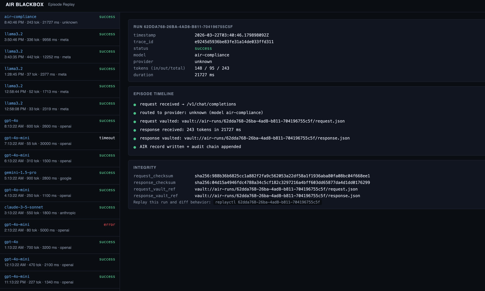

# AIR Blackbox

[](https://pypi.org/project/air-blackbox/)
[](https://pypi.org/project/air-blackbox/)
[](LICENSE)
[](https://airblackbox.ai)
[](https://github.com/airblackbox/airblackbox)
[](BENCHMARKS.md)

**The flight recorder for autonomous AI agents. Record, replay, enforce, audit.**

One proxy swap. Complete coverage. Runs locally.

```python
# Before
client = OpenAI(base_url="https://api.openai.com/v1")

# After - everything else in your code stays identical
client = OpenAI(
    base_url="http://localhost:8080/v1",
    default_headers={"X-Gateway-Key": "your-key"}
)
```

Every LLM call now generates a signed, tamper-evident, replayable audit record. No SDK changes. No refactoring. Measured overhead: ~3 ms per call, under 0.4% of a typical LLM request ([benchmarks](BENCHMARKS.md)).

## What You Get

**Audit chain**: every call produces an HMAC-SHA256 chained `.air.json` record, written asynchronously. Tamper with one record and every record after it breaks.

**Quantum-safe signing**: the chain is signed with ML-DSA-65 (FIPS 204 / Dilithium3). Keys are generated locally and never leave your machine. Post-quantum secure today.

**Evidence bundle**: one command packages the audit chain, scan results, and ML-DSA-65 signatures into a self-verifying `.air-evidence` ZIP. An auditor runs `python verify.py` and gets PASS/FAIL in two seconds. No pip install needed on their end.

**PII and injection scanning**: 20 weighted patterns across 5 attack categories detected before the prompt reaches the model. Configurable sensitivity. Auto-blocking.

**EU AI Act gap analysis**: 51+ checks across Articles 9, 10, 11, 12, 13, 14, 15. Maps to ISO 42001, NIST AI RMF, and Colorado SB 24-205. One scan, four frameworks, one report.

**Replay**: load any past episode from the audit chain, verify the HMAC signature, and replay every step with timestamps. Incident reconstruction without guesswork.

**Framework trust layers**: drop-in wrappers for LangChain, CrewAI, OpenAI Agents SDK, Anthropic, AutoGen, Google ADK, and Haystack. Same audit chain, native integration.

## Quickstart

```bash
pip install air-blackbox

# Run your first gap analysis - works on any Python AI project
air-blackbox comply --scan . -v

# Inventory runtime AI use and static AI-related dependencies
air-blackbox discover --scan-path .

# Export machine-readable AI-BOM/SBOM output
air-blackbox discover --scan-path . --format cyclonedx
air-blackbox discover --scan-path . --format spdx

# Replay any recorded episode
air-blackbox replay

# Generate a signed evidence package for audit or regulator review
air-blackbox export
```


## AI-BOM and Dependency Discovery

`air-blackbox discover` combines runtime-observed models, providers, and tools with static dependency scanning from your project:

```bash
air-blackbox discover --scan-path . --format table
air-blackbox discover --scan-path . --format cyclonedx
air-blackbox discover --scan-path . --format spdx
```

Formats:

- `--format table` is the human-readable inventory.
- `--format json` remains an alias for CycloneDX 1.6 JSON.
- `--format cyclonedx` emits CycloneDX 1.6 JSON.
- `--format spdx` emits SPDX 2.3 JSON.

Static scanning supports `requirements.txt`, `pyproject.toml`, `package.json`, and `package-lock.json`. `requirements.txt` and `pyproject.toml` provide declared direct Python dependencies only. `package.json` provides direct npm dependencies. `package-lock.json` v2/v3 can provide installed direct and transitive npm dependencies. Python transitive resolution is not performed, and discovery does not call the network, `pip`, `npm`, Poetry, or other package managers. `devDependencies` are currently excluded.

Each package in a reliable dependency graph is classified independently, so transitive AI libraries can be detected:

```text
application
  -> wrapper-package
     -> openai
```

Custom AI-library rules can extend or override the built-in classifier:

```bash
air-blackbox discover   --scan-path .   --ai-libraries custom-ai-libraries.yaml   --format cyclonedx
```

```yaml
version: 1
packages:
  python:
    my-ai-sdk:
      category: llm-sdk
      provider: Example AI
      reason: Internal AI SDK
  npm:
    "@example/ai-client":
      category: llm-sdk
      provider: Example AI
      reason: Internal AI client
```

Custom rules extend defaults; a rule with the same ecosystem and normalized package name overrides the default. Python names use PEP 503 normalization, and npm scoped package names such as `@example/ai-client` are supported. Invalid explicit classifier configuration exits with an error.

Use `--output` for machine-readable files:

```bash
air-blackbox discover   --scan-path .   --format spdx   --output sbom.spdx.json
```

Machine-readable output goes to the file, warnings go to stderr, JSON files are UTF-8 and end with a newline, and table output cannot be combined with `--output`.

Runtime model components include the model name, provider when observed, and explicit model version when available. AIR record or schema version is never treated as the model version.

Current limitations: no Python transitive resolution, no package-manager or network resolution, package-lock v2/v3 is the reliable transitive npm source, SPDX 2.3 represents models as packages plus annotations, and formal schema validation is not yet part of the test suite.

Full stack (Gateway + Episode Store + Policy Engine + observability):

```bash
git clone https://github.com/airblackbox/air-platform.git
cd air-platform
cp .env.example .env      # add OPENAI_API_KEY
make up                   # running in ~8 seconds
```

* Traces: `localhost:16686` (Jaeger)
* Metrics: `localhost:9091` (Prometheus)
* Episodes: `localhost:8081` (Episode Store API)

## Performance

Measured, reproducible, and published in [BENCHMARKS.md](BENCHMARKS.md):

* ~0.3 ms median overhead per call at low concurrency, ~3 ms under heavy load
* Under 0.4% of a realistic 800 ms LLM call at the median, under 1% at p99
* ~7,200 requests/sec single-node ceiling with full recording enabled
* 100/100 requests succeeded with the vault and OTel collector down - recording is best-effort, proxying is guaranteed

Reproduce it yourself: `bash bench/run-bench.sh && bash bench/failure-injection.sh`

## Episode Replay

Every request through the gateway produces a tamper-evident AIR record. The replay UI turns those records into a browsable timeline: model, provider, token usage, latency, checksums, and live audit chain verification.



```bash
pip3 install -r dashboard/requirements.txt
python3 dashboard/replay.py   # open http://localhost:8090
```

To re-execute a recorded run against the provider and diff the behavior, use `replayctl replay <run.air.json>`.

## Deploy on Kubernetes

```bash
helm install air deploy/helm/air-gateway \
  --set providerURL=https://api.openai.com \
  --set vault.existingSecret=air-vault-creds
```

Ships with 2 replicas, pod anti-affinity, health probes, and optional HPA. See [deploy/HA.md](deploy/HA.md) for the high-availability story, including how per-replica audit chains stay independently verifiable.

## How It Fits Your Stack

```
Your Agent
    |
    v
AIR Gateway          <- swap base_url here
    |
    |-- PII + injection scan      (before prompt reaches model)
    |-- HMAC audit record         (async, zero latency impact)
    |-- ML-DSA-65 signing         (keys never leave your machine)
    |
    v
LLM Provider         <- OpenAI / Anthropic / Azure / local
    |
    v
AIR Record           <- tamper-evident .air.json
    |
    v
Evidence Bundle      <- self-verifying .air-evidence ZIP
```

Works with any OpenAI-compatible API. Same format, same integration, regardless of provider.

## Why Not Just Log Everything?

You probably already have logging. The problems logging doesn't solve:

**Tamper-evidence**: anyone with write access to your log store can alter a record. HMAC chains make alteration detectable. ML-DSA-65 signatures prove who signed and when.

**Prompt reconstruction**: most logging captures responses but not the full prompt context, tool calls, and intermediate reasoning. AIR records the complete episode.

**Compliance structure**: EU AI Act Article 12 requires tamper-evident logs with specific retention and audit access guarantees. Raw logs don't satisfy that. Evidence bundles do.

**Secrets leaking into traces**: every team that builds their own logging eventually discovers credentials in their observability backend. AIR strips and vault-encrypts API keys before writing any record.

## Gate - Pre-Execution Policy Enforcement

Gate is a bilateral receipt system that governs what your AI agents are **allowed** to do and proves what they **actually did**. Every action goes through a covenant (policy), produces an Ed25519-signed receipt, and chains into a tamper-evident audit trail.

### Covenants - Declare What's Allowed

Write your agent's policy in YAML before it runs:

```yaml
# covenant.yaml
agent: loan-processor
version: "1.0"
rules:
  - permit: read_credit_score
  - permit: approve_loan
    when: "amount <= 50000"
  - require_approval: approve_loan
    when: "amount > 50000"
  - forbid: delete_records
  - forbid: modify_credit_score
```

Precedence: `forbid` > `require_approval` > `permit` > default deny.

### Bilateral Receipts - Two-Phase Proof

Every action produces a receipt with two cryptographic phases:

```python
from air_blackbox.gate import Gate, Covenant

covenant = Covenant.from_yaml("covenant.yaml")
gate = Gate(covenant=covenant)

# Phase 1: Authorization - checks covenant, signs decision
receipt = gate.authorize(
    agent_id="loan-processor",
    action_name="approve_loan",
    payload={"applicant": "jane@example.com", "amount": 75000},
    context={"amount": 75000},
)

if receipt.authorized:
    result = process_loan(...)

    # Phase 2: Seal - binds result to the authorization
    gate.seal(receipt, result=result, status="success")

# Third party can verify without the signing key
print(gate.verify(receipt))
# {'authorization_valid': True, 'seal_valid': True, 'overall': True}
```

**What the receipt proves:**
- The covenant hash locks which rules were active at decision time
- Ed25519 signatures (HMAC-SHA256 fallback) provide non-repudiation
- The seal covers the authorization signature, binding the full lifecycle
- Payloads are SHA-256 hashed - raw data never stored in the receipt

### Delegation Chains - Multi-Agent Traceability

When one agent delegates to another, the receipts chain together:

```python
# Parent agent authorizes its action
parent_receipt = gate.authorize("orchestrator", "delegate_task", ...)

# Child agent links back to the parent
child_receipt = gate.authorize(
    "notifier-agent", "send_confirmation",
    parent_receipt=parent_receipt,
)

# Walk the full chain
chain = gate.walk_delegation_chain(child_receipt)
# [orchestrator receipt, notifier receipt]
```

### Install

```bash
pip install air-blackbox[gate]   # includes Ed25519 via cryptography
```

## Ecosystem

`air-blackbox` is the scanner. `air-trust` is the cryptographic proof layer. `gate` is pre-execution policy enforcement.

```
Your AI Agent
       |
       |-- air-blackbox scan     ->  finds compliance gaps
       |-- air-blackbox gate     ->  pre-execution policy + bilateral receipts
       |-- air-trust             ->  proves what happened (HMAC + Ed25519)
       +-- air-blackbox-mcp      ->  all of the above inside Claude Desktop / Cursor
```

| Package | What It Does |
|---------|-------------|
| [air-trust](https://github.com/airblackbox/air-trust) | Tamper-evident audit chain + Ed25519 signed handoffs |
| [air-gate](https://github.com/airblackbox/air-gate) | Human-in-the-loop tool gating (Article 14) |
| [air-blackbox-mcp](https://github.com/airblackbox/air-blackbox-mcp) | MCP server for Claude Desktop, Cursor, Claude Code |
| [air-platform](https://github.com/airblackbox/air-platform) | Docker Compose - full stack in one command |
| [compliance-action](https://github.com/airblackbox/compliance-action) | GitHub Action - checks on every pull request |

## Validated By

* **Julian Risch** (deepset) - public validation on LinkedIn and GitHub issue #10810
* **Piero Molino** (Ludwig maintainer) - merged EU AI Act compliance changes driven by AIR scan results
* **arXiv AEGIS** (March 2026) - independent researchers published the identical interception-layer architecture for AI agent governance
* **McKinsey State of AI Trust 2026**: trust infrastructure named as the critical agentic AI category

## Contributing

See [CONTRIBUTING.md](CONTRIBUTING.md).

False positive on a compliance check? Correct it - your correction flows into training data for the fine-tuned scanner model. The scanner gets smarter with every fix your team submits.

Good first issues: labeled `good first issue` - mostly new compliance checks and framework integrations.

## License

Apache-2.0 - [airblackbox.ai](https://airblackbox.ai)

*This is not a certified compliance test. It is a starting point to identify potential gaps.*

---

If this helps you prepare for EU AI Act enforcement, [star the repo](https://github.com/airblackbox/airblackbox) - it helps other teams find it.
